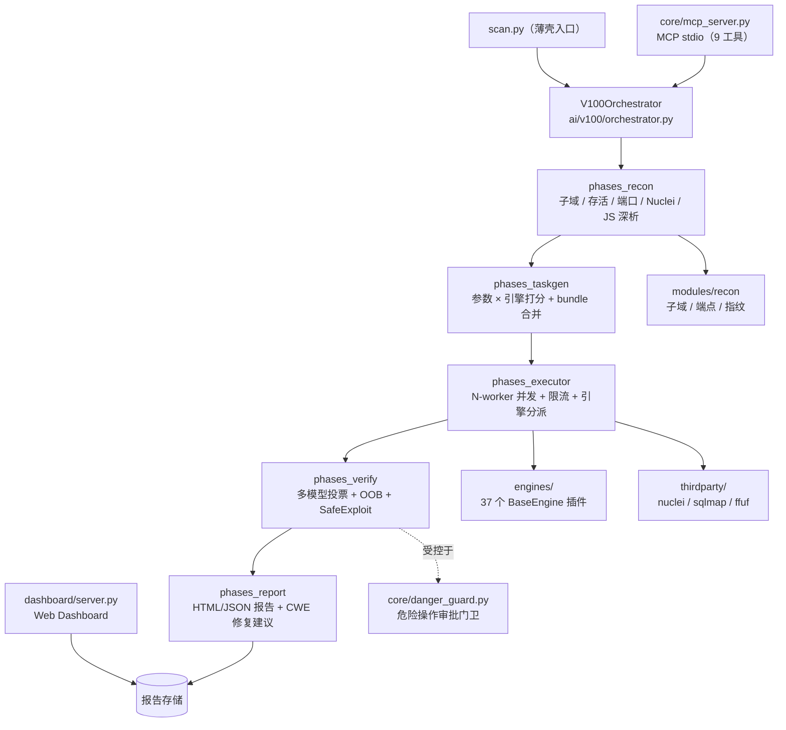

# pentest_platform

AI 驱动的自动化渗透测试平台（v103 · 基于 v100 限流感知编排与 v102 引擎重构）。

> 对外里程碑版本 v103 | PyPI 语义化版本 0.1.0 | License: AGPL-3.0-or-later（含 Classpath Exception）

> 37 个漏洞检测引擎 · 5 模型 AI 交叉验证 · 分布式多节点 · 侦察/攻击/验证/报告全链路自动化

---

## 定位（先读这一节）

一句话：**VULNCLAW = 任意模型可插的「验证 · 利用 · 审计」底座。**

1. **核心是可商用的授权渗透扫描引擎**——价值来自确定性引擎广度、工具集成、验证去伪与可审计合规，不来自"AI 有多聪明"。
2. **AI 是增强层，不是主体**——模型无关（BYOK）、Agent 可插（MCP）；模型越强，验证层越值钱。
3. **合规是不可协商的底座**——危险操作默认 deny、scope 校验、人工审批、防篡改审计凭证链。

- 完整架构图与分层职责：[docs/ARCHITECTURE.md](docs/ARCHITECTURE.md)
- 编号（SP\*/A\*/C\*/D\*/E\*）索引：[docs/CODE_INDEX.md](docs/CODE_INDEX.md)
- 引擎去留盘点：[docs/engine_disposition_report.md](docs/engine_disposition_report.md)
- 异步热路径体检：[docs/async_hotpath_report.md](docs/async_hotpath_report.md)

> **仅限对你拥有书面授权的目标进行测试**；使用者自担全部责任，与作者无关。

---

## 5 分钟快速上手（TL;DR）

1. **克隆仓库**：`git clone <your-repo-url> pentest_platform && cd pentest_platform`（或直接下载源码 zip 解压）。
2. **安装依赖**（Python ≥ 3.11）：
   ```bash
   pip install -e .
   ```
3. **配置 API Key**：`cp .env.example .env`，编辑 `.env` 填入 `AI_API_KEY`（默认 Provider 为智谱 zhipu，详见「获取 AI 模型 API Key」）。
4. **启动第一次扫描**：
   - Windows PowerShell：`.\start_vulnclaw.ps1 -Target http://testphp.vulnweb.com`
   - Linux / macOS：`./start_vulnclaw.sh -t http://testphp.vulnweb.com`
5. **看报告**：扫描结束输出至 `_runtime_cache/reports/`，用浏览器打开 `report_<target>_<时间戳>.html`（JSON + HTML 双格式，另含 SARIF）。

> **只想先跑纯引擎、不配任何 Key**：跳过第 3 步，在 `.env` 中设置 `AI_MODE=0`（纯引擎模式：不调用任何 AI，AI 增强自动降级，扫描照常执行）后直接运行第 4 步命令。

---

## 目录

- [5 分钟快速上手（TL;DR）](#5-分钟快速上手tldr)
- [项目简介](#项目简介)
- [架构总览](#架构总览)
- [环境要求](#环境要求)
- [快速开始](#快速开始)
- [配置说明](#配置说明)
- [分布式部署](#分布式部署)
- [Docker 一键部署](#docker-一键部署)
- [MCP 集成（对外 AI 接口）](#mcp-集成对外-ai-接口)
- [Dashboard 访问](#dashboard-访问)
- [常用入口](#常用入口)
- [目录结构](#目录结构)
- [内置引擎清单](#内置引擎清单)
- [第三方工具依赖](#第三方工具依赖)
- [商业授权与定价](#商业授权与定价)
- [输出产物](#输出产物)
- [版本记录](#版本记录)
- [常见问题](#常见问题-FAQ)
- [参与贡献](#参与贡献)

---

## 项目简介

pentest_platform 是一个单机可运行的 Web 渗透测试平台，核心特点：

1. **AI 驱动验证（非模板告警）**：多模型（智谱 / 通义 / DeepSeek 等）投票交叉验证，输出"确认/疑似/误报"分级结论，显著降低误报。
2. **自动化真验证**：`safe_verify` HTTP 重放 + interactsh OOB 回调 + SafeExploit 自动利用链，交付"可复现证据"而非疑似列表。
3. **限流感知调度**：自适应 QPS（429 指数退避 + 冷却 + 成功爬升），任务队列 + N-worker 并发，对目标友好。
4. **分布式多节点（v101）**：`scan.py --distributed --master/--worker` 基于 Redis 任务队列，Master 心跳监控 + Worker 离线故障转移，DAG 节点可在 Worker 上真实执行。
5. **代码安全扫描（v101）**：CodeQL（SARIF）+ Semgrep 双引擎，结果合并后统一送 AI 审计，报告含 `codeql_findings_count`。
6. **引擎插件化**：新增一个检测引擎 = 新增一个 `BaseEngine` 子类，自动被 `_load_engines` 装配，零侵入主流程（v101 新增反序列化引擎，覆盖 Java/PHP/Python）。
7. **第三方工具统一接入**：nuclei / ffuf / subfinder / sqlmap / interactsh / codeql 等统一由 `get_tool_path` 兜底解析（PATH → 系统 → thirdparty/）。

## 架构总览



<details>
<summary>文本版架构（Mermaid 不渲染时查看）</summary>

```
scan.py (唯一顶层入口，薄壳 → src/vulnclaw/)
   │
   ▼
src/vulnclaw/ai/v100/orchestrator.py   ← V100Orchestrator 编排器（阶段方法拆分至 phases/）
   ├── phases/phases_recon.py      侦察：子域/存活/端口/Nuclei/JS深析/FFUF/静态收集
   ├── phases/phases_taskgen.py    任务生成：参数×引擎打分 + bundle 合并
   ├── phases/phases_executor.py   执行：N-worker 并发 + 限流 + 引擎分派
   ├── phases/phases_verify.py     AI 验证：3模型投票 + safe_verify + OOB + exploit
   └── phases/phases_report.py     报告生成
   │
   ▼
src/vulnclaw/engines/   37 个漏洞检测引擎（BaseEngine 插件体系）
src/vulnclaw/modules/   recon（侦察）/ collectors（采集）/ vuln_scanner（漏洞扫描 6 子模块）
src/vulnclaw/core/      settings / logger / scanner / mcp_server / danger_guard / report_generator
thirdparty/             外部工具与字典（nuclei、sqlmap、ffuf 等二进制）
```

</details>

## 环境要求

| 项 | 要求 |
|---|---|
| Python | ≥ 3.11（推荐 3.12+） |
| 操作系统 | Windows / Linux / macOS（Windows 一线支持） |
| 网络 | 需访问目标站点 + 至少一个 AI Provider API |

安装依赖：

```bash
pip install -e .          # 基础依赖
pip install -e .[dev]     # 开发依赖（ruff / mypy / pre-commit / pytest-cov）
pre-commit install        # 可选：启用提交前检查
```

## 快速开始

### 方式一：一键启动脚本（推荐）

```bash
# Windows PowerShell
.\start_vulnclaw.ps1 -Target http://testphp.vulnweb.com

# Linux / macOS
./start_vulnclaw.sh -t http://testphp.vulnweb.com
```

脚本自动完成：Python 版本检查 → 虚拟环境创建 → 依赖安装 → .env 初始化（从 `.env.example` 复制）→ 健康检查 → 启动扫描。

常用脚本参数：

```powershell
# Windows: DAG 多 Agent + 深度利用（仅生成 POC）
.\start_vulnclaw.ps1 -Target http://target.com -Mode deep -Agents 6

# Windows: 危险模式（实际执行利用，慎用）
.\start_vulnclaw.ps1 -Target http://target.com -Mode deep -Dangerous

# Windows: 仅健康检查
.\start_vulnclaw.ps1 -Health
```

```bash
# Linux/macOS 等价命令
./start_vulnclaw.sh -t http://target.com --dag --agents 6 --deep
./start_vulnclaw.sh -t http://target.com --deep --dangerous
./start_vulnclaw.sh --health
```

### 方式二：手动运行

```bash
# 1. 配置 AI（首次必做，见下节）
cp .env.example .env    # 然后编辑 .env 填入 API Key

# 2. 跑第一次扫描
python scan.py -t http://testphp.vulnweb.com

# v103 起也支持子命令语法（scan / code / health）
# 不带子命令时按旧 scan.py 参数风格自动兼容转发，两种写法等价：
python scan.py scan -t <目标URL> --dag --agents 6
python scan.py code --repo /path/to/repo --lang python
python scan.py health

# 常用参数
python scan.py -t <目标URL> \
    --max-tasks 100 \        # 最大任务数
    --initial-qps 2 \        # 初始 QPS
    --proxy http://127.0.0.1:8080 \  # 走 Burp 代理
    --cookie-file cookies.txt       # 手动指定 Cookie

# DAG 多 Agent + 深度利用（仅生成 POC）
python scan.py -t <目标URL> --dag --agents 6 --deep

# 分布式多节点（需 Redis，见"分布式部署"）
python scan.py --distributed --master --redis-url redis://localhost:6379/0

# 代码安全扫描（CodeQL + Semgrep，本地目录/远程仓库）
python scan.py --code --repo /path/to/repo --lang python
```

### 方式三：指令直写账号密码（--instruction，对标 Strix）

不需要预先准备 Cookie——直接在指令里写账号密码，平台会自动登录目标并托管认证会话：

```bash
# Strix 风格：长句直写
python scan.py -t http://target.com --instruction "Login with email: admin@target.com, password: Pass#123"

# 中文键值对 + 登录页 + 测试重点 + 排除项（一条指令全搞定）
python scan.py -t http://target.com --instruction "账号: admin@target.com 密码: Pass#123；登录页: https://target.com/auth/login；重点: sql, xss，排除: /logout, /static"

# 多账号 / 多角色（列表形式，供 IDOR / 越权引擎以多角色会话交叉验证）
python scan.py -t http://target.com --instruction-file instruction.txt
```

`instruction.txt` 内容示例：

```
- 管理员: admin@target.com / Admin#1
- 普通用户: user@target.com / User#1
登录页: https://target.com/auth/login
重点: 越权, 会话
排除: /logout
```

**指令支持的内容**：

| 要素 | 写法（中英文均可） | 作用 |
|---|---|---|
| 账号密码 | `Login with email: ... , password: ...` / `账号: ... 密码: ...` / `- 角色: 用户 / 密码` | 自动登录目标并落盘 Cookie（第 0 步，优先于既有 Cookie 流程） |
| 登录页 | `login_url: https://...` / `登录页: https://...` | 指定登录端点（缺省尝试 `/login`） |
| 测试重点 | `focus on: ...` / `重点: sql, xss` | 提升对应引擎优先级 + 增强 payload 上限 |
| 排除项 | `out of scope: ...` / `排除: /logout` | 命中目标即跳过该任务 |

**行为与安全**：

- 多账号时：第 1 个为主账号，其余注册为角色会话，供 IDOR / 越权引擎交叉验证（两者权限应当不同）。
- 登录方式自动降级：优先 Playwright 渲染登录，缺失时走 HTTP 表单登录；全部失败自动回退既有 Cookie 流程，不影响扫描。
- 登录失败不影响扫描继续（默认凭据缺失/错误时按未认证状态扫描）。
- 密码明文只存在于内存中的指令对象：日志一律输出 `username:***` 脱敏摘要；**不要把含真实密码的指令文件提交进 git**（建议加入 `.gitignore`，或使用 `--instruction` 内联配合 shell 历史保护）。

扫描结束后报告输出至 `_runtime_cache/reports/`（JSON + HTML）。

## 配置说明

AI 模型配置在项目根 `.env` 文件（已被 .gitignore 忽略，**切勿提交**）：

```env
# 模型别名 → 实际模型名
AI_MODEL_ALIASES={"1":"glm-4-flash","2":"qwen-plus-2025-07-28","4":"deepseek-ai/DeepSeek-V3.1-Terminus","5":"glm-4.7"}
# 各 provider 的 api_key / base_url
AI_MODEL_CONFIGS={"glm-4-flash":{"api_key":"...","base_url":"https://open.bigmodel.cn/api/paas/v4/"}}
# AI 档位：0~4 五种模式（0=纯引擎不调 AI；1/2/3/4=启用前 N 个模型）
AI_MODE=4
# 启用哪些模型（用别名，可自定义任意数量/新模型）
AI_MODELS=["1","2","4","5"]
# Provider 故障转移顺序（首个可用为止）
PROVIDER_PRIORITY=["zhipu","aliyun","siliconflow"]
```

> **AI 档位（0~4 五种模式）**：`AI_MODE=0` 即纯引擎模式，所有 AI 增强（验证/过滤/线索）自动降级为规则模式，扫描能力不受影响；`AI_MODE=1~4` 分别启用 1~4 个模型（`4` 为默认全量交叉验证）。不设置 `AI_MODE` 时按 `AI_MODELS` 全量（默认 4 个），`AI_MODELS` 本身也支持任意数量与自定义模型名。

> 提示：也可以不手写，直接运行 `python tools_menu.py` 选择「3. 切换 AI 配置」交互式向导。

完整环境变量清单见 [.env.example](.env.example)。

### 获取 AI 模型 API Key

平台默认使用智谱（zhipu）作为 AI Provider（`AI_PROVIDER=zhipu`），在 `.env` 中配置：

```env
AI_PROVIDER=zhipu
AI_API_KEY=你的真实Key
AI_API_BASE=https://open.bigmodel.cn/api/paas/v4/
```

- 复制模板：`cp .env.example .env`（Windows PowerShell 用 `Copy-Item .env.example .env`）。
- 多模型时用 `AI_MODEL_CONFIGS`（JSON）：为每个模型配置 `api_key` 与 `base_url`，模型名见 `AI_MODEL_ALIASES`；也可以只用 `AI_PROVIDER` + `AI_API_KEY` 的单模型快捷方式（与 `AI_MODEL_CONFIGS` 二选一）。
- Key 获取渠道：

| Provider | 一句话说明 | 官网 |
|---|---|---|
| 智谱（默认） | 注册账号后在控制台创建 API Key | https://open.bigmodel.cn/ |
| 阿里云百炼 | 开通百炼服务后获取 DashScope API Key | https://dashscope.aliyun.com/ |
| DeepSeek | 开放平台创建 API Key | https://platform.deepseek.com/ |
| 硅基流动 | 注册后创建 API Key | https://siliconflow.cn/ |

> 模板占位 Key（`your_api_key_here`）会导致 401 认证失败并熔断该 Provider，务必替换为真实 Key；不想用 AI 时设 `AI_MODE=0` 走纯引擎模式。

## 分布式部署

### DAG 多 Agent 并行（单机，当前推荐）

`--dag` 模式将扫描编排为 DAG（侦察 6 节点并行 → 攻击 → 验证 → 利用 → 深度利用 → 报告），`--agents` 控制并行 Agent 数：

```bash
# 单目标，6 个并行 Agent
python scan.py -t http://target.com --dag --agents 6

# 多目标批量扫描（每行一个 URL）
python scan.py -l targets.txt --dag --agents 6
```

多目标模式下每个目标独立一条 DAG 链（context 按目标前缀隔离），调度器自动做节点级并发与资源限额。

### 多节点部署（v101 可用）

v101 起支持 Redis 任务队列的 Master/Worker 分布式模式（需本机或远端可用 Redis）：

```bash
# 终端 1：启动 Master（心跳监控 + 故障转移，Ctrl+C 停止）
python scan.py --distributed --master --redis-url redis://localhost:6379/0

# 终端 2：启动 Worker（注册 recon/attack/verify 能力，循环拉取执行任务）
python scan.py --distributed --worker --redis-url redis://localhost:6379/0
```

> 说明：Master 监控 Worker 心跳并对离线节点做故障转移；Worker 按 `task.type` 调度 `dag.executor.NODE_EXECUTORS` 真实执行。单机多 Agent（`--dag --agents N`）仍是单目标吞吐的首选模式。

## Docker 一键部署

```bash
docker compose up -d --build     # 启动：Redis + Master + 2 Worker
docker compose scale worker=4    # 按需扩容 Worker
docker compose down              # 停止
```

- AI 凭证：把本机 `.env` 放到仓库根目录即可被容器读取（`env_file` 为可选项，没有也能启动，仅 AI 能力降级）。
- 镜像内含 Python 运行环境与 nmap；第三方二进制未打包，对应能力自动降级（不影响引擎主流程）。
- 纯单机模式：`docker compose run --rm master scan -t <目标URL>`

## MCP 集成（对外 AI 接口）

内置 MCP Server（stdio / JSON-RPC 2.0），让 Cursor、Claude Desktop、ZCode、TraeWork 等任何支持 MCP 的
客户端把扫描器当作工具直接调用，无需理解命令行。

```bash
python -m vulnclaw.core.mcp_server
```

客户端配置（`mcpServers`）：

```json
{
  "mcpServers": {
    "vulnclaw": {
      "command": "python",
      "args": ["-m", "vulnclaw.core.mcp_server"],
      "cwd": "/absolute/path/to/pentest_platform",
      "env": { "PYTHONIOENCODING": "utf-8" }
    }
  }
}
```

已暴露 9 个工具：

| 工具 | 用途 | 危险 |
|---|---|---|
| `scan.start` / `scan.status` / `scan.findings` | 启动扫描、查进度、取漏洞 | 启动为危险操作 |
| `scan.api_audit` | API 深度审计（GraphQL DoS / 限速绕过 / JWT 重放） | ⚠️ |
| `scan.deep` | 单点深度渗透（ReAct 推理 Agent 自主循环，30 工具动态调度） | ⚠️ |
| `browser.explore` | AI 浏览器代理自主探索站点 | ⚠️ |
| `exploit.verify` | 单漏洞利用验证（HTTP 重放 + OOB） | ⚠️ |
| `code.audit` | 代码审计（Semgrep + CodeQL + 依赖 CVE） | 否 |
| `intel.lookup` | 威胁情报查询（Shodan / Censys） | 否 |
| `scan.danger_guard_status` | 查询权限门卫模式与审批审计 | 否 |

> ⚠️ 类工具受**危险操作门卫**控制，默认全部拒绝（安全默认）。
> 放行方式：`--dangerous`、或 `DANGEROUS_MODE=allow`、或最小权限 `DANGEROUS_ALLOW=exploit_verify`。

配置可一键生成（默认只打印，加 `--write` 才写入，且先备份 `.bak` 再合并，不覆盖已有配置）：

```bash
vulnclaw mcp install --client cursor --write     # 生成并写入 Cursor 配置
vulnclaw mcp token                               # 远程接入时用的强随机 token
```

> 需要让**云端** AI（不在本机）接入时，用 `vulnclaw mcp http`。默认只监听 `127.0.0.1`（外网连不进来，零风险）；
> 只有显式监听非本机地址时才强制要求 token，否则拒绝启动。安全设计见文档。

完整接入指南见 [docs/mcp_integration.md](docs/mcp_integration.md)。
从零上手见 [docs/quickstart.md](docs/quickstart.md)。

## Dashboard 访问

### 扫描报告（当前可用）

每次扫描结束后自动生成 JSON + HTML 双格式报告，直接用浏览器打开即可查看漏洞详情、严重性分布与利用证据：

```
_runtime_cache/reports/report_<target>_<时间戳>.html   ← 浏览器打开
_runtime_cache/reports/report_<target>_<时间戳>.json   ← 程序化消费
```

DAG 模式的报告额外包含 `dag_profile` 字段（最慢 3 节点 / 并发峰值 / 资源限额），便于性能复盘。

### Web Dashboard（预留）

`.env` 中的 Dashboard 监听配置已预留：

```env
DASHBOARD_HOST=0.0.0.0
DASHBOARD_PORT=8080
```

> ⚠️ 当前版本暂无内置 Web Dashboard 服务；HTML 报告即为可视化入口，Web 端在路线图中。

## 常用入口

| 入口 | 用途 |
|---|---|
| `.\start_vulnclaw.ps1` / `./start_vulnclaw.sh` | 一键启动（环境检查 + 健康检查 + 扫描） |
| `python scan.py -t <url>` | 唯一顶层扫描入口 |
| `调试.bat`（双击） / `python tools_menu.py` | 管理工具菜单（AI 调试/配置切换/系统维护/浏览器代理） |
| `python merge_tool.py` | 模块合并维护工具（开发用） |
| `scripts/` | 上述脚本的实际实现位置（根目录为兼容跳板） |

## 目录结构

```
pentest_platform/
├── scan.py              🚩 唯一顶层入口（薄壳 → vulnclaw.cli）
├── start_vulnclaw.ps1   🚀 Windows 一键启动
├── start_vulnclaw.sh    🚀 Linux/macOS 一键启动
├── .env                 ⚙️ 运行配置（不提交）
├── .env.example         ⚙️ 配置模板（全量可配置项）
├── CHANGELOG.md         📝 版本变更记录
├── src/vulnclaw/        📦 唯一主包（src-layout）
│   ├── cli.py           统一 CLI（scan / code / health 子命令，兼容旧参数转发）
│   ├── core/            框架核心（settings/logger/scanner/persistence/report_generator/utils/paths）
│   ├── engines/         37 个检测引擎（BaseEngine 自动装配，含反序列化）
│   ├── ai/              AI 编排（v100 当前版 + provider_failover + tools）
│   ├── modules/         recon / collectors / vuln_scanner
│   ├── dag/  distributed/  deepsec/  code/  dashboard/
│   ├── config/          静态配置与字典
│   └── paths.py         路径解析单源（项目根 / thirdparty / data）
├── scripts/             维护脚本（tools_menu / merge_tool / 调试.bat）
├── tests/               测试（布局守卫 / 导入 / 冒烟 / 单元）
├── docs/                文档（design/ guides/ api/）
├── thirdparty/          外部工具与模板（sqlmap/nuclei-templates/...）
└── _runtime_cache/      运行时产物（logs/reports/cookies，已 gitignore）
```

## 内置引擎清单

| 分类 | 引擎 |
|---|---|
| 注入类 | xss / sqli / lfi / cmdi / ssti / nosql / el_injection / ldap / xxe / crlf |
| 认证权限 | idor / jwt / oauth / session |
| HTTP 传输 | security_headers / host_header / open_redirect / cache_poison / cors / ssrf |
| 业务辅助 | business_logic / file_upload / race_condition / info_leak / request_smuggling / api_version_diff / http2_ws / graphql |
| 反序列化 | deserialization（CWE-502，Java/PHP/Python） |

> 另有 `dotnet_deserialization` 及按需加载的高级引擎；v102 重构后 `jwt_advanced` 已并入 `auth_engines`、`sensitive_files` 已并入 `input_engines`。
>
> v103 起 `business_logic` 引擎新增 **AI 业务流程分析**（默认开启，可用环境变量 `ENABLE_BUSINESS_AI_ANALYSIS=false` 关闭）：从扫描上下文收集 API 调用序列并构建业务流程图，由 LLM 识别跳过支付、流程绕过、状态跳变、批量越权等异常流程，输出带 `ai_report` 详细分析（业务影响 / 修复建议 / 受影响端点）的漏洞报告。
>
> v105 新增引擎：`mobile`（移动端 API 安全：弱认证/明文传输/越权）、`container_security`（容器/K8s 配置风险）、`api_security`（API 深度检测：GraphQL DoS/速率限制绕过/JWT 重放）。

## 第三方工具依赖

以下工具**可选**，缺失时对应步骤自动降级（不影响整体运行）：

| 工具 | 用途 | 查找顺序 |
|---|---|---|
| nuclei | CVE 模板扫描 | PATH → `C:\Users\<u>\go\bin` → thirdparty/ |
| ffuf | 目录爆破 | 同上 |
| subfinder / assetfinder | 子域收集 | 同上 |
| interactsh-client | OOB 带外检测 | 同上 |
| sqlmap | SQL 注入深度验证 | thirdparty/sqlmap/ |

> 🚨 **Burp Suite 用户自备声明**：VULNCLAW 的 `burp-bridge` 扩展（`thirdparty/burp-bridge/vulnclaw-bridge-1.0.8.jar`，源代码 `thirdparty/burp-bridge/VulnclawBridge.java`）为 VULNCLAW 项目自身原创代码，采用与 VULNCLAW 主项目一致的 AGPL-3.0 许可证分发。**Burp Suite Professional 本身是 PortSwigger 公司的商业专有软件，用户需自行安装合法 License 的 Burp Suite ≥ 2026.7 后才可使用 burp-bridge 功能**；本仓库不包含任何 Burp Suite 二进制、注册机或破解补丁。

#### Burp 桥扩展加载说明（拿不到代理历史的 99% 原因）

扫描器与 Burp 的「代理历史」通道依赖 `vulnclaw-bridge.jar` 扩展写入
`proxy_history.jsonl`（桥目录下的增量事件文件）。**只有把 jar 加载进 Burp
Extender，代理历史才会被扫描器读取**；若仅开启 Burp REST API，则只能使用
Intruder / Replay / 协作器，历史数据仍为空。

```text
加载步骤（Burp Suite ≥ 2026.7 Professional）：
1. 打开 Burp → Extender / Extensions 标签页
2. 点击 Add → Extension Type 选 Java
3. Location 选择本仓库 thirdparty/burp-bridge/vulnclaw-bridge-1.0.8.jar
4. 确认扩展列表出现 VulnclawBridge，Status 为 Loaded
5. 重新启动扫描，Burp 代理拦截流量即写入 proxy_history.jsonl
```

**验证是否生效**：扫描日志出现 `✅ Burp REST API 连接成功` 且后续
`历史数据新增 N 个` 非空，即说明桥扩展加载成功。若日志出现
`Burp 插件文件不存在: burp_cookies.json`，那只是可选的手动 Cookie 导入文件
缺失（`CRAWL_AUTHED` 未配置时无影响），不影响桥功能。

#### 无 Burp 部署（Burp 是可选组件，不是依赖）

**没有 Burp Suite 也能完整使用 VULNCLAW**——Burp 桥（代理历史回灌 / REST API
联动）只是增强项，核心扫描链路（引擎撒网 → AI 审讯 → Agent 深挖 → 报告）
完全不依赖它：

```text
1. 注释 .env 里的 PROXY 行（或运行时加 --no-proxy），避免请求被发往
   未启动的 127.0.0.1:8080 代理导致全站请求失败；
2. 不配置 BURP_API_URL / BURP_API_KEY 即可——扫描器探活失败会自动
   跳过代理历史通道，日志只出现一次性告警，不影响任何引擎执行；
3. thirdparty/burp-bridge/ 目录可以整个保留（不会被加载），也可移除。
```

> 口径：`PROXY` 未启动是"无 Burp 部署"最常见的假死根因（本地 127.0.0.1
> 目标自动绕过代理所以看不出）。扫描器启动时已内置代理预检并告警。

**爬虫预算配置说明（为什么爬取次数少 / 如何加大）**：同源链接爬虫
（`crawl_same_origin`）默认 `max_depth=2、max_urls=80`，备用爬虫默认
`max_depth=2、max_urls=30`——这是防爆炸上限，本地小型站点两次即可爬完，
属正常现象；对真实站点会自动启用 katana / gau / waybackurls 扩大覆盖。
如需放宽预算，可在 `.env` 中调整：

| 环境变量 | 默认 | 作用 |
|---|---|---|
| `MAX_CRAWL_ENDPOINTS` | 60 | 爬虫端点喂给引擎的数量上限 |
| `MAX_CRAWL_SEED_URLS` | 15 | 迭代爬虫的种子 URL 数量 |
| `MAX_CRAWL_BATCH` | 30 | 每轮爬虫批处理 URL 数 |
| `MAX_CRAWL_ROUNDS` | 3 | 迭代爬虫轮数（默认 8，启动时兜底为 3） |

> 注意：`max_depth` 与 `max_urls` 为代码内预算常量（见
> `src/vulnclaw/modules/recon.py` 的 `crawl_same_origin`），如有特殊需求
> 可直接修改后重新安装；常规场景建议优先调上面的 env 参数即可。

## 商业授权与定价

> 一句话：**个人 / 研究 / 开源项目 → AGPL-3.0 免费；**闭源商业集成 / SaaS 能力整合 / 企业使用 → 购买本页商业授权，免去 AGPL 强传染义务并获得企业级功能。
>
> **询价与购买**：邮件 `vulnclaw.official@outlook.com`（标题注明「**[商业授权] 公司名 - 方案**」，我们会在 1 个工作日内回正式报价单）。

```
┌─────────────────────────────────────────────────────────────────────────────┐
│  VULNCLAW Commercial License — 商业授权定价表（人民币 / 年付）                │
├─────────────────────────────────────────────────────────────────────────────┤
│                                                                             │
│  开源版（AGPL-3.0）           ¥ 0        个人 / 学生 / 开源项目 免费用        │
│  轻量版（个人 / 小团队）       ¥ 30 / 年   单人安全研究、10 人以内团队自用     │
│  专业版（研发 / 安全团队）     ¥ 99 / 年   30 人以内研发 / 红蓝 / 安全团队     │
│  商业版（企业 / 集成商）      ¥ 199 / 年   不限人数；闭源集成 SaaS / 交付品    │
│  ─────────────────────────────────────────────────────────────────────────  │
│  定制 / 私有化部署             邮件询价    RBAC · 审计 · 告警 · 面板 · SLA    │
│                                                                             │
└─────────────────────────────────────────────────────────────────────────────┘
```

### 授权包含权益

| 权益 | 开源版 ¥0 | 轻量版 ¥30 | 专业版 ¥99 | 商业版 ¥199 | 定制 |
|---|---|:---:|:---:|:---:|:---:|
| 免 AGPL-3.0 强传染（可闭源集成到商业产品 / SaaS） | ❌ | ✅ | ✅ | ✅ | ✅ |
| 漏洞检测核心引擎（37+ BaseEngine） | ✅ | ✅ | ✅ | ✅ | ✅ |
| 5 模型 AI 交叉验证 | ✅ | ✅ | ✅ | ✅ | ✅ |
| DAG 攻击编排 + 分布式 Worker | ✅ | ✅ | ✅ | ✅ | ✅ |
| MCP 接口（MIT 子许可） | ✅ | ✅ | ✅ | ✅ | ✅ |
| Burp Montoya Bridge | ✅ | ✅ | ✅ | ✅ | ✅ |
| **企业级：多租户 RBAC + 权限分组** | ❌ | ❌ | ✅ | ✅ | ✅ |
| **企业级：审计日志 & 操作回放** | ❌ | ❌ | ✅ | ✅ | ✅ |
| **企业级：Jira / 飞书 / 企微 告警联动** | ❌ | ❌ | ✅ | ✅ | ✅ |
| **私有化集群管理面板** | ❌ | ❌ | ❌ | ✅ | ✅ |
| 邮件技术支持（工作日） | ❌ | 社区 Issue | 72h 响应 | 24h 响应 | 专项对接 |
| 年度安全更新与小版本升级 | ✅ | ✅ | ✅ | ✅ | ✅ |
| 大版本升级（v104 → v105…） | ✅ | ✅ | ✅ | ✅ | ✅ |
| NDA / 源代码托管 / 现场部署 | ❌ | ❌ | ❌ | 可选 | ✅ |

### 采购流程（3 步走）

1. **邮件询价** → 发送到 `vulnclaw.official@outlook.com`，标题「**[商业授权] 公司名 - 方案档位**」，请附：使用场景、是否需要发票、期望授权起始日期。
2. **1 工作日内收到正式报价单**（含税/不含税双档）+ 付款账户信息。
3. **付款 → 发送授权证书 + 企业功能包下载链接**，开通对应 SLA 技术支持通道。

> 💡 参考锚点：PortSwigger Burp Suite Professional 单用户年费约 **$449 USD / 人**。VULNCLAW 商业版 **¥199 / 年 不限人数**，一杯咖啡的成本覆盖整个安全团队。

## 输出产物

所有运行时产物统一写入 `_runtime_cache/`（不入库）：

- `_runtime_cache/logs/scan_YYYYMMDD_HHMMSS.log` — 全量日志
- `_runtime_cache/reports/report_<target>_<ts>.json|.html` — 扫描报告
- `_runtime_cache/cookies/` — 会话 Cookie

## 版本记录

见 [CHANGELOG.md](CHANGELOG.md)。v100-stable → v101 变更一览：

- **v101**：分布式多节点（`--distributed --master/--worker`）、CodeQL 代码扫描、反序列化检测引擎、配置模板全量化、启动脚本增强。
- **v100-stable**：28 引擎 + v100 限流感知编排 + DAG 多 Agent + AI 交叉验证的基线稳定版。

## 常见问题 (FAQ)

**Q: 启动报 `llama-cpp-python 未安装` 警告？**
A: 正常，本地推理是可选项；只用云端 API 可忽略。

**Q: Nuclei / FFUF 返回 0 结果？**
A: 先确认二进制可被找到（日志会有 PATH/exit/stderr 详情）；`C:\Users\<u>\go\bin` 与 thirdparty/ 均会自动兜底。

**Q: 子域名收集对内网目标很慢？**
A: 内网/回环/私网目标会自动跳过 OTX/Urlscan 等外部 API，属于预期行为。

**Q: 找不到 `subdomains_top5000.txt`？**
A: 字典在 `src/vulnclaw/core/data/subdomains_top5000.txt`，`_resolve_wordlist_path` 会自动按 根→config→thirdparty 顺序解析。

**Q: 没有 API Key 能跑吗？**
A: 能。设置 `AI_MODE=0` 走纯引擎模式：不调用任何 AI，AI 增强（验证/过滤/线索）自动降级为规则模式，扫描照常执行。

**Q: 高级功能（TLS 指纹伪装 / 向量记忆 / 调用链分析 / Dashboard）怎么开？**
A: 这些是可选的依赖，默认 `pip install -e .` 不安装（代码内 try/except 优雅降级）。运行 `pip install -e .[full]` 安装 curl_cffi、chromadb、tree-sitter、fakeredis、uvicorn 等即可启用。

**Q: 第三方工具（nuclei / sqlmap / nmap）没装怎么办？**
A: 缺失时对应步骤自动降级，不影响主流程；也可以设置 `TOOL_AUTO_INSTALL=true`（默认开启）让平台启动时尽力自动安装，GitHub 直连失败时会按 `TOOL_DOWNLOAD_MIRRORS` 配置的镜像前缀（默认 gh-proxy.com / ghproxy.net）依次重试。

**Q: 分布式扫描怎么开？**
A: 需要本机或远端可用 Redis，然后 `docker compose up -d --build` 一键启动（Redis + Master + 2 Worker）；也可以手动 `python scan.py --distributed --master` 与 `python scan.py --distributed --worker` 分开启动。

**Q: 内网 / 靶场使用有什么要注意？**
A: 危险操作默认 `DANGEROUS_MODE=deny`（安全默认，write/destructive 级别被拦截），需显式传 `--dangerous` 或 `DANGEROUS_ALLOW` 放行。请确保已获得目标系统的书面测试授权，仅用于合法授权的渗透测试与安全学习。

**Q: 报告在哪里？**
A: 扫描报告输出至 `_runtime_cache/reports/`（JSON + HTML 双格式，浏览器打开 HTML 即可查看），同时默认输出 SARIF 文件（`REPORT_SARIF=true`）；全量日志在 `_runtime_cache/logs/`。

## 参与贡献

见 [CONTRIBUTING.md](CONTRIBUTING.md)。新增检测引擎 5 分钟即可接入（有完整模板）。

---

## License

本项目仅供授权渗透测试与安全学习使用。使用前请确保已获得目标系统的书面测试授权。
