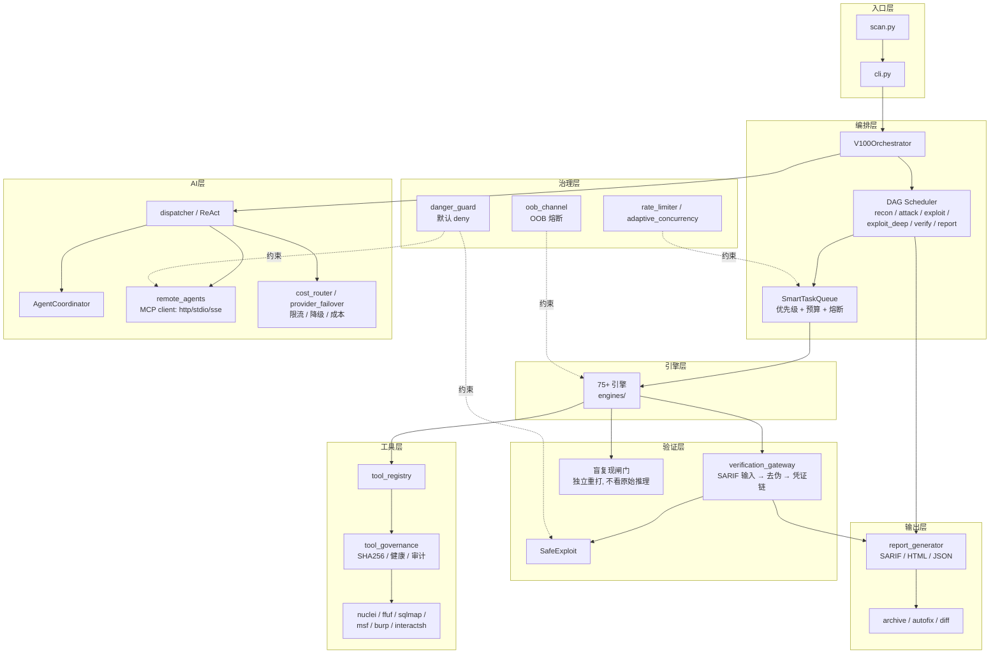

# VULNCLAW 架构总览

> 本文件回应评审点 5「定位四重撕裂」：先把定位写清楚，再谈架构。
> 架构图只画**当前真实存在的层次**，不画规划中的东西。

## 定位声明（三句话）

1. **核心是可商用的授权渗透扫描引擎**——价值来自确定性引擎广度、工具集成、验证去伪与可审计合规，不来自"AI 有多聪明"。
2. **AI 是增强层，不是主体**——模型无关（BYOK）、Agent 可插（MCP）；模型越强，验证层越值钱。
3. **合规是不可协商的底座**——`danger_guard` 默认 deny、scope 校验、人工审批、防篡改审计凭证链。这不是技术装饰，是法律资产。

一句话：**VULNCLAW = 任意模型可插的「验证 · 利用 · 审计」底座。**

## 架构图



## 数据流（一次扫描）

```
target
  → recon（子域/端口/目录/JS/ Nuclei CVE）
  → taskgen（按参数 × 引擎撒网，生成任务入 SmartTaskQueue）
  → attack（多 worker 并发执行引擎，AI 粗筛 + 本地规则复核）
  → verify（交叉验证 → 盲复现闸门 → 三态裁决 confirmed/refuted/inconclusive）
  → report（确定性去重 → lifecycle 标记 → SARIF/HTML/JSON + 防篡改凭证链）
  → 交付（archive / autofix / diff）
```

## 层次职责（一句话）

| 层 | 职责 | 关键入口 |
|---|---|---|
| 入口层 | CLI 子命令（scan/code/health/mcp/verify/tools/archive/...） | `cli.py` |
| 编排层 | 阶段调度、任务队列、预算与超时 | `dag/scheduler.py`、`ai/v100/phases/` |
| 引擎层 | 确定性漏洞检测（75+） | `engines/` |
| AI 层 | ReAct/多 Agent/远程 MCP/成本与限流 | `ai/dispatcher.py`、`ai/v100/` |
| 验证层 | 去伪存真、盲复现、防篡改凭证 | `core/verification_gateway.py` |
| 工具层 | 外部工具解析、健康检查、调用审计 | `core/tool_registry.py`、`core/tool_governance.py` |
| 治理层 | 危险操作审批、限流、并发自适应、OOB 熔断 | `core/danger_guard.py`、`core/oob_channel.py` |
| 输出层 | 报告生成与交付物 | `core/report_generator.py` |

## 相关索引

- 编号（SP\*/A\*/C\*/D\*/E\*）含义索引：见 `docs/CODE_INDEX.md`（自动生成，只索引不解释）
- 引擎去留盘点：见 `docs/engine_disposition_report.md`
- 异步热路径体检：见 `docs/async_hotpath_report.md`
