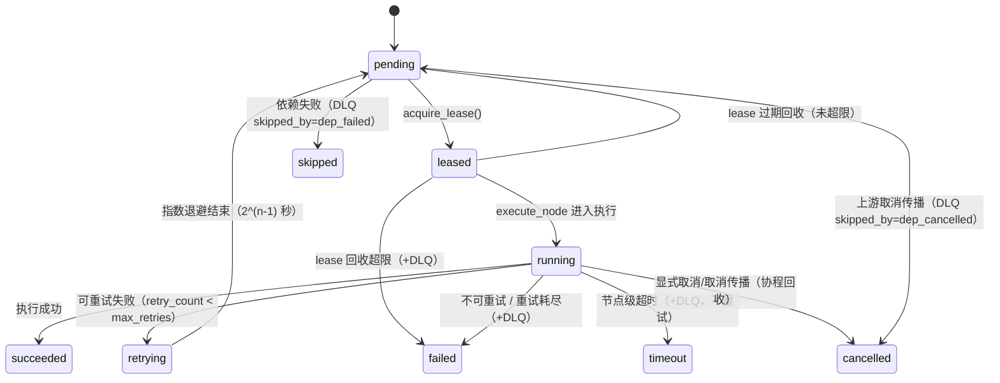

# DAG 任务状态机（DAG STATE MACHINE）

> C1 交付。实现：`src/vulnclaw/dag/graph.py`（状态定义）+ `scheduler.py`（迁移逻辑）。
> 验收：`tests/test_dag_fault_injection.py`（19 例）+ `tests/test_dag_retry.py`（4 例，零回归）。

## 1. 状态集合

```text
pending      就绪前/回收后等待调度
leased       C1：已被调度器领取（占用），尚未进入执行；lease 过期可被回收
running      执行中（有活跃 asyncio.Task；心跳续租保命）
succeeded    成功（终态）
retrying     指数退避期间挂起（防重复提交），退避结束回 pending
failed       失败（终态；可重试失败经重试耗尽后落此态 + 死信）
timeout      C1：节点级超时被强制回收（终态，不重试）
cancelled    C1：显式取消 / 上游取消传播 / 执行中被取消（终态，不重试）
skipped      依赖失败/上游取消的连带跳过（非死信，落 DLQ 台账 skipped_by 标记）
dead_letter  重试耗尽 / 节点超时 / lease 回收超限（真·死信，落 DLQ）
```

终态集合（`TERMINAL_STATUSES`）：`succeeded / failed / timeout / cancelled / dead_letter / skipped`。
失败集合（`FAILURE_STATUSES`）：`failed / timeout / dead_letter`（触发下游 SKIPPED）。

## 2. 状态迁移图



## 3. 关键语义

| 机制 | 语义 | 实现位置 |
|---|---|---|
| lease（领取/续租/回收） | 重复投递被丢弃（非 owner 持有未过期 lease → False）；RUNNING 且有活跃任务不回收；未超限回 PENDING，超限死信 | `acquire_lease` / `renew_lease` / `recover_expired_leases` |
| 失败分类 | timeout / network / resource / permanent / cancelled / unknown；**permanent 与 cancelled 不重试**（ValueError/KeyError/FileNotFoundError 等代码类错误归 permanent） | `classify_failure` / `is_retryable` |
| 指数退避 | `2^(retry_count-1)` 秒；退避期间置 RETRYING 防重复提交 | `_handle_failure` |
| 节点级超时 | `DAGNode.timeout>0` 时 `asyncio.wait_for` 强杀；TIMEOUT 终态**不重试**（重试只会再烧一个超时窗口） | `execute_node` |
| 取消传播 | 父取消 → 全部下游（传递闭包）CANCELLED；执行中协程 `task.cancel()` 回收；终态节点幂等不动 | `cancel_node` / `cancel_all` / `_descendants` |
| 幂等闸门 | 同锁内判定+置位：终态早退、RUNNING 拒绝重入、lease 持有拒绝；`_exec_counts` 机器可证"单节点单次执行" | `execute_node` 头部 |
| 部分成功 | `outcome = success / partial_success / failed / cancelled`；失败节点单列 `failures` 台账，成功节点结果照常可用 | `_build_profile` / `_outcome` |
| 死信队列 | `_runtime_cache/dag_dead_letter/<scan_id>.jsonl`；`state=dead_letter`（真死信）vs `state=skipped + skipped_by`（跳过类） | `_write_dlq` / `executor.write_dead_letter` |

## 4. 失败原因分类表

| reason | 触发 | 可重试 |
|---|---|---|
| `timeout` | asyncio.TimeoutError / 消息含 timeout | ✅ |
| `network` | OSError / 连接类消息 | ✅ |
| `resource` | MemoryError / 句柄/磁盘类消息 | ✅ |
| `permanent` | ValueError/TypeError/KeyError/AttributeError/ImportError/FileNotFoundError 等 | ❌ 直接终结 |
| `cancelled` | asyncio.CancelledError | ❌ 转 CANCELLED |
| `unknown` | 其余 | ✅ |

## 5. Blocked 项（需真实环境）

- **Redis 跨进程 lease**：当前 lease 是**内存实现**（`DAGScheduler` 单进程内）；跨 worker/跨进程互斥需 Redis 后端（本机无 Redis 服务，未实现，未验证）。
- **容器级故障恢复**：worker 进程被杀 → 另一 worker 回收 lease 的端到端演练，需 Docker 环境（见 docs/DEPLOYMENT.md）。
- **Redis 重启后任务恢复**：需真实 Redis。

## 6. 复现

```powershell
python -m pytest tests/test_dag_fault_injection.py tests/test_dag_retry.py -q --disable-warnings
```
