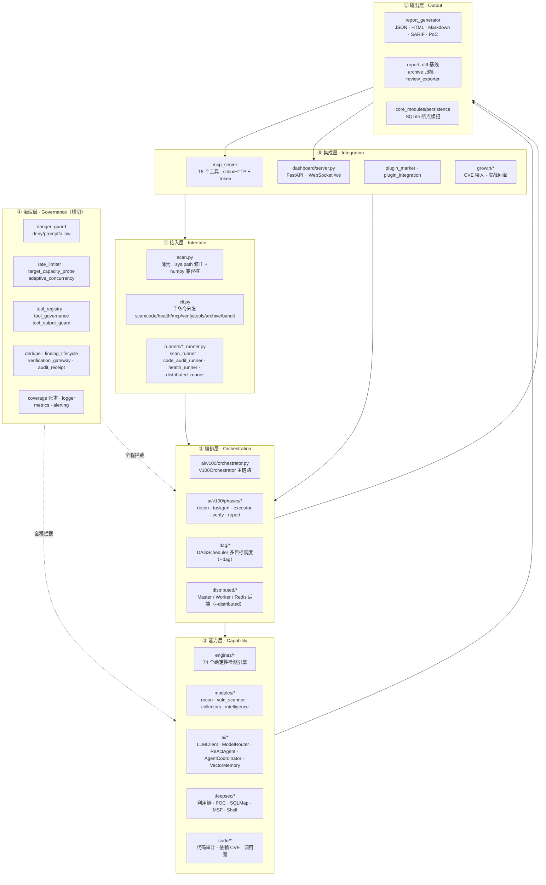
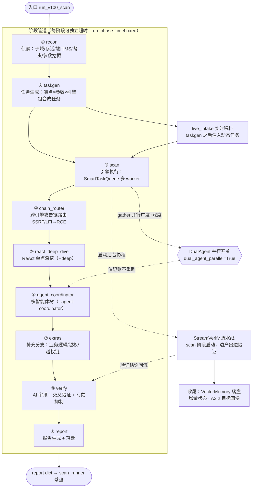
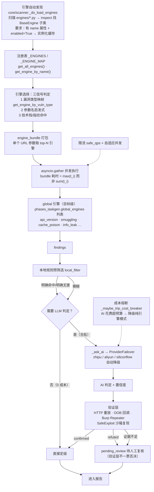
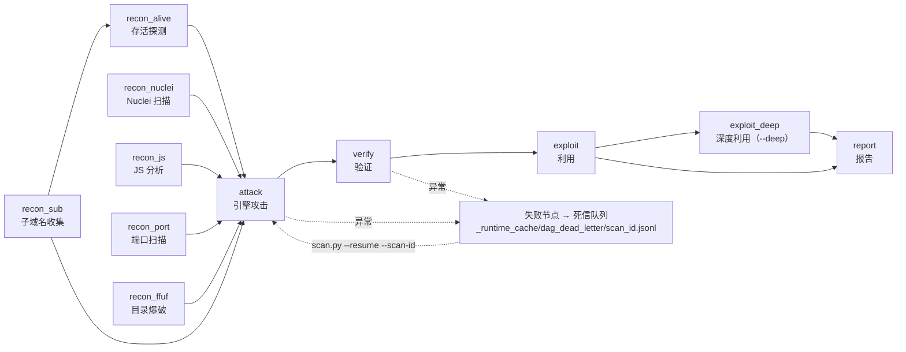
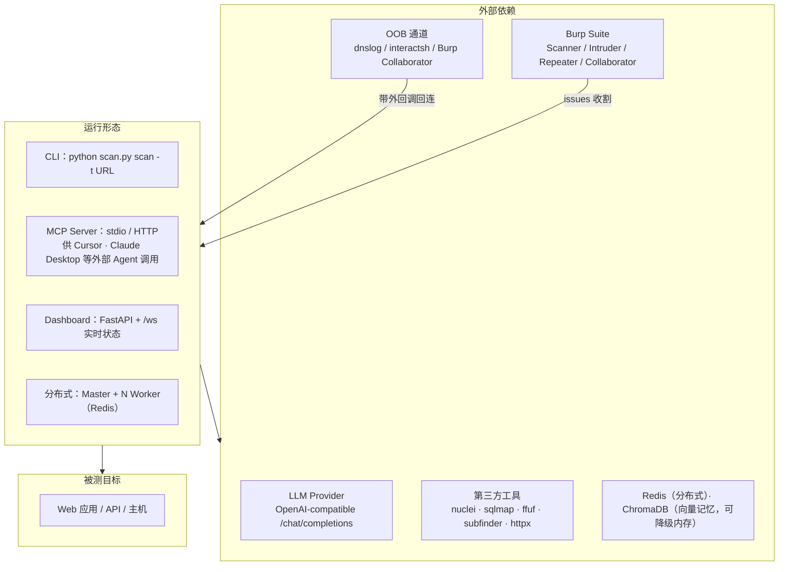

# VULNCLAW 系统架构图

> 版本基准：v103（src-layout）｜生成日期：2026-09-07
> 源码锚点：`src/vulnclaw/`（入口 `scan.py` → `src/vulnclaw/cli.py`）
> 本文件为「图集」，配套文字说明见 `system_design.md`。

---

## 图 1：总体分层架构

**要点**

- 接入层刻意做薄：`scan.py` 只负责把 `src/` 顶到 `sys.path` 最前（防止陈旧 `.pth` 影子副本劫持 import）并注入 numpy 兼容桩，业务逻辑全在包内。
- 编排层是**逐层复用**而非三套平行实现：分布式 Worker 复用 `dag/executor.NODE_EXECUTORS`（`distributed/worker.py:249`），DAG 的 recon/attack 节点复用 `V100Orchestrator` 的阶段方法（`_recon` / `_generate_tasks` / `_execute_with_limiting`，`dag/executor.py:192-397`）。差异只在「谁驱动阶段顺序」。
- 治理层是**横切而非纵向**——限流、危险门卫、去重、审计账本在每一层都通过钩子介入。

---

## 图 2：主链路阶段编排（V100Orchestrator）

源码：`ai/v100/orchestrator.py` 的 `scan()`（约 L1617–L1722），阶段方法由 `ai/v100/phases/__init__.py::bind_phase_methods` 以 `MethodType` 动态绑定。

**要点**

- 阶段顺序即 `_STAGES`：recon → taskgen → scan → chain_router → react_deep_dive → agent_coordinator → extras → verify → report。
- `scan` 阶段一开始即启动 **StreamVerify** 后台协程，findings 边产出边验证，不堆到最后集中判定。
- `DualAgent` 开启时，`scan`（广度）与 `agent_coordinator`（深度）用 `asyncio.gather` 并行，汇合墙钟 = `max(主链路, 副通道)`；副 agent 受软截止收割，不拖累主链路。

---

## 图 3：端到端数据流（数据对象视角）

```mermaid
flowchart LR
    T["目标 URL<br/>-t / -l 目标列表"] --> AUTH

    subgraph PRE["前置"]
        AUTH["认证会话建立<br/>Cookie 文件 / 浏览器 / Burp / 默认凭证 / --instruction 指令登录"]
        PROBE["target_capacity_probe<br/>探测目标安全 QPS/并发"]
    end

    AUTH --> CTX
    PROBE --> RATE

    CTX["ScanContext（core/context.py）<br/>url_graph · param_index · responses(LRU)<br/>tech_stack · sensitive_leaks · verified/suspected_vulns"]

    CTX --> GEN["任务生成 phases_taskgen<br/>端点 × 参数 × 引擎名 = Task"]

    GEN --> Q["SmartTaskQueue（ai/v100/smart_queue.py）<br/>PrioritizedTask 优先级堆 1-10<br/>bandit 可选 RL 排序 · 受保护任务豁免清理"]

    Q --> W["worker 池（并发上限由 adaptive_concurrency + safe_qps 决定）"]

    W --> ENG["引擎执行 core/scanner.run_engine<br/>scan(目标级) / check(参数级)"]

    ENG --> RAW["原始 findings<br/>type · severity · url · parameter · evidence · curl_command"]

    RAW --> FILT["本地预筛选 local_filter<br/>0 成本规则过滤 → 降 AI 调用"]

    FILT --> AI["AI 批判定 _ask_ai<br/>ModelRouter 选模 · batch_processor 合批<br/>A4.4 分层：明确项不进 LLM"]

    AI --> VERRY["验证与治理<br/>StreamVerify · 交叉验证 · OOB 回调<br/>hallucination_suppress 幻觉抑制"]

    VERRY --> DED["去重 + 生命周期<br/>dedupe · finding_lifecycle<br/>confirmed / refuted / pending_review"]

    DED --> REP["报告 report_generator<br/>JSON · HTML · Markdown · SARIF 2.1.0 · PoC 产物"]

    REP --> LEDGER["账本与回流<br/>coverage.json 覆盖账本<br/>report_diff 基线 · growth 实战回灌"]

    RATE["rate_limiter 自适应限流"] -.-> W
    DG["danger_guard 危险门卫"] -.-> ENG
    DG -.-> EXP["deepsec 深度利用<br/>需 --dangerous 放行"]
    VERRY -.-> EXP
```

**关键数据对象**

| 对象 | 定义位置 | 主要字段 |
| --- | --- | --- |
| `ScanContext` | `core/context.py:25` | `url_graph`、`param_index`、`responses`(LRU)、`normal_responses`、`tech_stack`、`sensitive_leaks`、`verified_vulns`、`suspected_vulns`、`burp_issues` |
| `PrioritizedTask` | `ai/v100/smart_queue.py:49` | `task_id`、`priority`(1–10)、`data`、`created_at`；`is_protected_task` 保护动态补测任务 |
| Finding（dict） | 引擎产出，规范见 `core/models.py:Vulnerability` | `type`、`severity`、`url`、`parameter`、`payload`、`evidence`、`confidence`、`ai_analysis`、`cve_ids`、`cvss_score`、`curl_command`、`reproduction_steps`、`oob_evidence` |
| `VulnerabilityStrict` / `WebAsset` / `ScanContextModel` | `core/models.py` | pydantic 严格模型，用于边界校验 |
| DAG 节点 | `dag/graph.py:DAGNode` | `node_id`、`node_type`、`target`、`params`、`depends_on`、`status`、`retry_count` |

---

## 图 4：引擎调度与验证闭环

**要点**

- 引擎是**确定性底座**，AI 只做"模糊判定"与"深挖"，两者解耦：弱模型/无模型时仍能产出引擎级结论。
- 验证层铁律：**refuted 不直接删除**，降级为 `pending_review` 待人工复核，避免误杀导致的漏报。

---

## 图 5：DAG 模式节点拓扑（`--dag`）

源码：`dag/graph.py`（15 种 `NodeType`）、`dag/scheduler.py`、`dag/executor.py`（`NODE_EXECUTORS`）、构建逻辑在 `runners/scan_runner.py:1395+`。

**要点**

- 多目标时按 `t0/t1/...` 前缀复制子图，并共享一个 `batch_recon_sub` 批量子域节点。
- 上下文隔离靠 `dag/context.py::DAGContext` + `dag/executor.py::_ctx_key(prefix, key)`，节点间通过 context key 传数据。
- DAG **不另起炉灶**：`dag/executor.py` 的 recon 节点实例化 `V100Orchestrator` 并跑 `_recon()`（L192-218，实例存入 `DAGContext`），attack 节点取回同一实例跑 `_generate_tasks()` + `_execute_with_limiting()`（L387-395）；分布式 Worker 进一步复用 `NODE_EXECUTORS`。
- 因此 DAG/分布式**少跑 4 段**：`chain_router`、`react_deep_dive`、`agent_coordinator`、`extras` 属于 v100 `scan()` 的线性编排，DAG 模式下改由 `exploit` / `exploit_deep` 节点承担深挖。

---

## 图 6：运行形态与外部依赖

---

## 附录：模块 ↔ 图元速查

| 图元 | 路径 |
| --- | --- |
| CLI 入口 | `scan.py`、`src/vulnclaw/cli.py`、`scan_main.py` |
| 扫描 runner | `src/vulnclaw/runners/scan_runner.py`（`main_async`） |
| 主编排器 | `src/vulnclaw/ai/v100/orchestrator.py`（`V100Orchestrator`） |
| 阶段实现 | `src/vulnclaw/ai/v100/phases/{phases_recon,phases_taskgen,phases_executor,phases_verify,phases_report}.py` |
| 任务队列 | `src/vulnclaw/ai/v100/smart_queue.py` |
| 引擎注册/分发 | `src/vulnclaw/core/scanner.py` |
| 引擎实现 | `src/vulnclaw/engines/*.py`（基类 `engines/base.py`） |
| 侦察 | `src/vulnclaw/modules/recon.py`、`modules/vuln_scanner/*` |
| AI 基座 | `src/vulnclaw/ai/core.py`、`ai/dispatcher.py`、`ai/provider_failover.py` |
| 治理 | `core/danger_guard.py`、`core/tool_registry.py`、`core/verification_gateway.py`、`core/finding_lifecycle.py` |
| 报告 | `core/report_generator.py`、`core/report_diff.py`、`core/coverage.py` |
| 集成 | `core/mcp_server.py`、`dashboard/server.py`、`core/plugin_market.py` |
