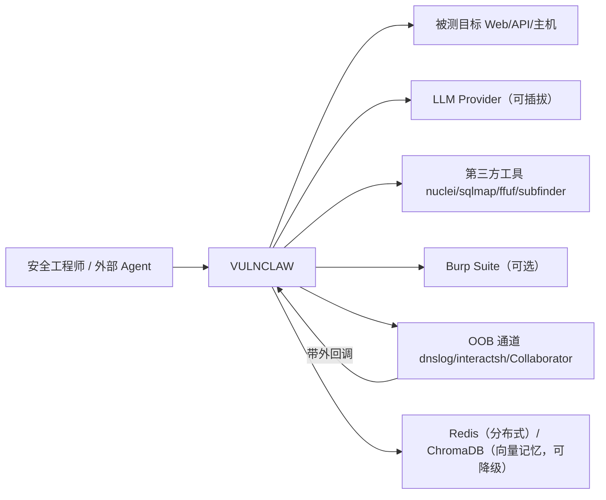

# VULNCLAW 系统设计文档

> 版本基准：v103（src-layout）｜生成日期：2026-09-07
> 配套图集：`docs/design/architecture.md`
> 本文所有结论均以 `src/vulnclaw/` 源码为准（关键处标注文件与行号）。

---

## 1. 定位与设计原则

VULNCLAW 是一套**模型无关、引擎优先**的自动化渗透测试平台：用确定性检测引擎铺开覆盖面，用 AI 做模糊判定与单点深挖，用独立验证层把"引擎猜的"和"AI 说的"都拉回可复现的证据。

| 原则 | 落地体现 |
| --- | --- |
| **引擎优先（确定性底座）** | `engines/` 74 个引擎类自动发现注册；AI 只处理规则判不定的部分（`local_filter` + A4.4 分层），弱模型/无模型仍可产出结论 |
| **模型无关（BYOK）** | `ai/core.py::LLMClient` 为标准 OpenAI-compatible 客户端（`base_url` + `/chat/completions` + Bearer）；`provider_failover.py` 多 Provider 自动降级 |
| **AI 不替代证据** | 每个 finding 必须带 `evidence` / `curl_command` / `reproduction_steps`；OOB 类附 `oob_evidence`；验证层 `refuted` 不删除，降级 `pending_review` |
| **危险操作默认拒绝** | `core/danger_guard.py` 三态 `deny` / `prompt` / `allow`，默认 `deny`；`--dangerous` 才放行利用类动作 |
| **可审计** | `core/coverage.py` 覆盖账本（谁跑了/谁跳过/谁失败）、`core/audit_receipt.py` 回执、`tool_governance` 每次工具调用审计落 `tool_usage.jsonl` |
| **任何一层挂掉都不拖垮主链路** | 治理/验证/报告侧钩子统一吞异常；阶段级超时（`phase_timeout_*_s`）到点跳过而非崩溃 |

---

## 2. 系统上下文



- **必需依赖**：Python 运行环境 + 至少一个 LLM Provider（或 `--no-auth` 无 AI 降级模式）。
- **可选增强**：第三方工具缺失时 `ensure_thirdparty_tools()` 尽力安装，失败降级不阻塞；Burp 未配置则跳过；ChromaDB 初始化超时降级内存模式（`orchestrator.py:1606`）；Redis 不可用时分布式模块有 fakeredis 兜底。

---

## 3. 核心模块职责

### 3.1 接入层

| 模块 | 职责 |
| --- | --- |
| `scan.py` | 极薄外壳：把 `src/` 插入 `sys.path[0]`（防陈旧 `.pth` 影子副本劫持 import）、装 numpy 兼容桩（Python 3.13+/Windows 段错误防护）、强制 UTF-8、把第三方工具的 `HOME` 重定向到 `_runtime_cache/tools/` |
| `cli.py` | 现代子命令分发：`scan` / `code` / `health` / `mcp` / `verify` / `tools` / `archive` / `bandit-report` / `bandit-train` / `setup` |
| `scan_main.py` | 旧参数风格兼容存根（`python scan.py -t URL`），转发到 `runners/*_runner.py` |
| `runners/scan_runner.py` | `main_async()`：环境检查 → Cookie/指令登录 → 分流（DAG / 代码审计 / v100）→ 报告落盘（JSON+HTML+SARIF+覆盖账本+基线 diff） |
| `runners/code_audit_runner.py` | 代码审计入口（Semgrep + CodeQL + 依赖 CVE + AI 复核） |
| `runners/distributed_runner.py` | 分布式 Master/Worker/提交端入口 |

### 3.2 编排层

| 模块 | 职责 |
| --- | --- |
| `ai/v100/orchestrator.py` | **主链路大脑** `V100Orchestrator`：阶段管道、模型池与降级、成本熔断、流式验证、checkpoint 续扫、阶段计时账本 |
| `ai/v100/phases/__init__.py` | `bind_phase_methods()` 把 5 个阶段模块的函数以 `MethodType` 绑成编排器实例方法（少数静态工具函数直接挂） |
| `phases_recon.py` | 侦察：子域、存活、端口、JS、爬虫、参数挖掘、Burp/Collaborator 收割、技术栈识别 |
| `phases_taskgen.py` | 任务生成：端点 × 参数 × 引擎 → Task；`global_engines`（目标级引擎，如 `api_version`、`cache_poison`、`info_leak`）；`max_total_tasks` 膨胀上限 |
| `phases_executor.py` | 执行：worker 池、`engine_bundle` 并发执行、ReAct 深挖、链路由、多智能体协调、冲突消解 |
| `phases_verify.py` | 验证：本地规则验证 → LLM 分层判定 → 交叉验证 → 幻觉抑制 → Burp Repeater 复现 → 去重 |
| `phases_report.py` | 报告组装与统计 |
| `dag/` | `--dag` 多目标调度：`DAG`（拓扑排序/环检测）+ `DAGScheduler`（并发上限=agents）+ `executor.NODE_EXECUTORS`（节点→协程）+ `DAGContext`（节点间数据总线）+ 死信队列。**节点内部复用 v100**：recon 节点建 `V100Orchestrator` 跑 `_recon()`，attack 节点跑 `_generate_tasks()` + `_execute_with_limiting()` |
| `distributed/` | Master 派发 / Worker 执行 / Redis 后端；小目标自动降级单机。**Worker 复用 `dag/executor.NODE_EXECUTORS`**（`worker.py:249`） |

**阶段管道**（`orchestrator.scan()`，L1617–1722）：

```
recon → taskgen → [live_intake 动态喂料] → scan（同时启动 StreamVerify）
      → chain_router → react_deep_dive → agent_coordinator → extras → verify
      → 收尾（VectorMemory / 增量状态 / A3.2 目标画像）→ report
```

### 3.3 能力层

**① 引擎层（`engines/`，74 个引擎类）**

- 基类 `engines/base.py::BaseEngine`；两个能力入口：`scan(target, session)` 目标级、`check(url, param, normal_resp, parsed_query, session)` 参数级。
- 自动发现：`core/scanner.py::_do_load_engines()` 遍历 `engines/*.py`，`inspect` 找 `BaseEngine` 子类，要求具备 `name` 且 `enabled=True`，实例化后缓存到 `_ENGINES` / `_ENGINE_MAP`（双锁：asyncio + threading）。
- 统一分发：`core/scanner.py::run_engine()` —— 有 `scan` 覆盖走 `scan`，否则拉基线后走 `check`；结果写覆盖账本（`record_run` / `record_skipped` / `record_failed`）。
- 分类分布：web/web_advanced（11）、input（8）、logic_leak_2（8）、auth（6）、framework_zero_day ×2（10）、net（5）、http（5）、http_advanced（2）、middleware（3）、auxiliary（3）、api_security/api_version（3）、leak_logic（2）、以及 deserialization / dotnet_deserialization / state_chain / deep_chimera / container / parsing_shadow / mobile / websocket 各 1。
- 引擎侧工具函数：`build_attack_url`（payload 编码唯一出口）、`obfuscate_payload`、`enrich_finding`（补 `curl_command` / `reproduction_steps`）、`attach_oob_evidence`（OOB 证据段）。

**② 侦察层（`modules/`）**

- `recon.py`：子域（subfinder/assetfinder/CT/爆破）、存活探测、端口与 banner、同源爬取、参数挖掘与候选池。
- `vuln_scanner/`：业务逻辑、认证与越权、Nuclei CVE、目录爆破、OOB（interactsh）、AI 验证。
- `collectors.py` 数据收集、`live_intake.py` 实时喂料、`request_feed.py` 请求流、`intelligence/shodan_client.py` 威胁情报。

**③ AI 层（`ai/`）**

| 模块 | 职责 |
| --- | --- |
| `ai/core.py` | AI 基座：LLMClient（OpenAI-compatible）、TokenBudget、ModelRouter、AgentRuleEngine、VectorMemory（ChromaDB，可降级）、ClueEngine/ClueGenerator、AdaptiveML、LocalLLM、ContextManager |
| `ai/provider_failover.py` | 多 Provider 故障转移与降级 |
| `ai/v100/rate_limiter.py` | 自适应限流（按响应码/延迟动态调 QPS，5xx 风暴自动降速） |
| `ai/v100/local_filter.py` | 0 成本本地预筛选，减少 60–80% LLM 调用 |
| `ai/v100/batch_processor.py` | 请求合批 |
| `ai/v100/smart_queue.py` | 优先级任务队列（heapq，priority 1–10）+ 可选 RL bandit 排序 + 受保护任务豁免清理 |
| `ai/v100/bandit*.py` | 上下文老虎机：训练 / 报告 / 飞轮 |
| `ai/dispatcher.py` | Agent 体系：`ReActAgent`、`Blackboard`、`Mailbox`、`AgentNode`、`AgentCoordinator`（可寻址 agent 树）、`PayloadGenerator` |
| `ai/tools.py` | Agent 可用工具集与能力声明 |
| `ai/remote_agents.py` | 远程 Agent 协同；`ai/burp.py` Burp 集成；`ai/cost_router.py` 成本路由 |

**④ 深度利用（`deepsec/`）**：`exploit_chain.py`（链编排）、`poc_generator.py`、`sqlmap_wrapper.py`（API 守护进程 + CLI 回退）、`msf_rpc.py`、`shell_channel.py`、`priv_esc_planner.py`。**全部受 `danger_guard` 控制，默认仅生成 POC 不执行。**

**⑤ 代码审计（`code/`）**：`dependency_scanner.py`（依赖 CVE）、`ai_auditor.py`（AI 复核 + 修复建议）、`graph.py`（调用图）、`repo_manager.py`。

### 3.4 治理层（横切）

| 模块 | 职责 |
| --- | --- |
| `core/danger_guard.py` | 危险操作门卫：`deny`/`prompt`/`allow` + `dangerous_allow_list` 白名单，模式别名兼容布尔写法 |
| `core/tool_registry.py` | 工具统一入口 `run_tool()`：路径解析 → 治理预检（供应链完整性抽检）→ 沙箱/直执 → 健康记录 → 审计落盘；失败降级与 fallback 表 |
| `core/tool_governance.py` | 工具治理：完整性抽检、调用审计 `tool_usage.jsonl`、降级依据 |
| `core/tool_output_guard.py` | 工具输出净化（防超大/污染输出进入 LLM 上下文） |
| `core/http_client.py` / `core/utils.py` | HTTP 统一出口、`safe_request`（5xx 不重试，避免 SQLi 重试拖死）、会话与代理 |
| `core/proxy_pool.py` | 代理池健康检查与轮换 |
| `core/target_capacity_probe.py` | 目标容量探测：早期测出安全 QPS/并发，供全链路限流 |
| `core/adaptive_concurrency.py` | 并发自适应（Little's Law 估算 + 下限保护） |
| `core/dedupe.py` / `core/finding_lifecycle.py` | 三层去重与生命周期：`confirmed` / `refuted` / `pending_review` / `fixed`，账本跨扫描迁移 |
| `core/verification_gateway.py` | 独立二次验证网关（`vulnclaw verify` 子命令）：归一化 → 去重互证 → 静态分诊 → LLM 预筛 → 盲复现（sandbox）→ 置信度打分 → 已验证 SARIF + 审计回执 |
| `core/coverage.py` | 机器事实覆盖账本：`coverage.json`（检查了什么/跳过谁/谁失败） |
| `core/audit_receipt.py` | 审计回执（防篡改校验） |
| `core/sandbox.py` / `sandbox_runner.py` | 沙箱执行（盲复现、POC 试跑） |
| `config/settings.py` + `core/settings.py` | pydantic-settings 配置（`core/settings.py` 转发到 `config.settings`，保持旧 import 兼容）；`allowed_scope` 提供 scope 硬约束 |

### 3.5 输出层

| 模块 | 职责 |
| --- | --- |
| `core/report_generator.py` | HTML（75KB 模板逻辑）、Markdown、SARIF 2.1.0、PoC 产物 |
| `core/report_diff.py` | 扫描基线 + 增量 diff |
| `core/archive.py` | 扫描归档（可打包 zip） |
| `core/review_exporter.py` | 人工复核导出 |
| `core_modules/persistence.py` / `sqlite_persistence.py` | SQLite 断点状态（P5-1 `--resume-scan`） |
| `core_modules/metrics.py` | Prometheus 指标（`--metrics-port`） |
| `core_modules/alerting.py` / `cache.py` / `asset_profile.py` | 告警、缓存、目标画像（A3.2 增量扫描基础） |

### 3.6 集成层

| 模块 | 职责 |
| --- | --- |
| `core/mcp_server.py` | MCP Server（15 个工具）：`scan.start` / `scan.status` / `scan.findings` / `scan.api_audit` / `scan.danger_guard_status` / `browser.explore` / `exploit.verify` / `code.audit` / `scan.deep` / `scan.deep_remote` / `intel.lookup` / `engine.list` / `engine.run` / `burp.scan` / `burp.intruder`；支持 stdio 与 HTTP（Token + IP 白名单 + BanList） |
| `dashboard/server.py` | FastAPI：状态/扫描/发现/Worker 查询 + `/ws` 实时推送 + `/metrics` |
| `core/plugin_market.py` / `plugin_integration.py` | 插件市场（安装/列出/更新）与插件接线 |
| `growth/bridges.py` | 自动成长：CVE 情报摄入 → 规则草稿；实战经验回灌（默认关闭） |

---

## 4. 数据流详解

### 4.1 六段流转

**① 目标与会话建立**
`scan_runner.main_async()`：`extract_target_cookies()`（Burp 文件 → 浏览器 → 默认凭证 → 手动输入，Cookie 落 `_runtime_cache/cookies/{host}.json`）→ `--instruction` 指令登录优先（`core/auth/instruction_auth.try_instruction_login`）→ `get_shared_session()` 建会话。

**② 目标画像与容量探测**
`target_capacity_probe` 探测目标安全 QPS/并发 → 写入限流器与并发控制器；`asset_profile` 维护历史画像（`--diff` 只测变化面）。

**③ 侦察 → 上下文**
结果汇入 `ScanContext`（`core/context.py`）：`url_graph`、`param_index`、`responses`（LRU）、`tech_stack`、`sensitive_leaks`、`interesting_endpoints`、`burp_issues`。**这是全局唯一的事实来源**，后续所有阶段只读它 + 追加。

**④ 任务生成 → 队列**
`phases_taskgen._generate_tasks()` 把「端点 × 参数 × 引擎」组合成 Task 推入 `SmartTaskQueue`；优先级由漏洞类型/技术栈/历史命中决定，可选 RL bandit 参与排序；`max_total_tasks` 截断尾部防膨胀。目标级引擎走 `global_engines` 单独入队。

**⑤ 执行 → 判定 → 验证**
worker 取任务 → `core/scanner.run_engine()` → 原始 findings → `local_filter` 0 成本预筛 → 模糊项合批送 LLM（`_ask_ai`，模型由 `ModelRouter` 选，Provider 失败自动 failover）→ StreamVerify 后台边产边验 → 交叉验证 / OOB 回调 / Burp Repeater → `hallucination_suppress` 幻觉抑制。

**⑥ 收敛 → 报告 → 回流**
`dedupe` + `finding_lifecycle` 收敛 → `phases_report` 生成报告 dict → `scan_runner` 落盘 JSON/HTML/SARIF → `coverage.json` 覆盖账本 → `report_diff` 基线 → `growth` 回灌（默认关）→ VectorMemory 跨会话记忆。

### 4.2 三条并发控制线

| 控制线 | 实现 | 保护对象 |
| --- | --- | --- |
| 目标侧 | `rate_limiter`（自适应 QPS）+ `target_capacity_probe`（safe_qps）+ `adaptive_concurrency` | 不打挂目标、不触发 429/WAF 封禁 |
| LLM 侧 | `batch_processor` 合批 + `local_filter` 预筛 + `TokenBudget` + `_maybe_trip_cost_breaker` 成本熔断 | 不烧钱、不被慢接口拖死 |
| 阶段侧 | `_run_phase_timeboxed` + `phase_timeout_*_s` + 死信队列 + checkpoint | 单阶段卡死不拖垮整体 |

### 4.3 引擎池与可达性（覆盖缺口）

引擎**不是注册即运行**，必须进入下列登记点：

| 登记点 | 位置 | 数量 | 作用 |
| --- | --- | --- | --- |
| 引擎类定义 | `engines/*.py` | 74 | 继承 `BaseEngine` + `name`，`core/scanner` 自动发现 |
| 包导出 | `engines/__init__.py` | 74 | 手工 import + `__all__`（漏了就 import 不到） |
| 参数级池 | `phases_taskgen.engine_priority`（L159-221） | 59 | 决定「端点 × 参数」任务携带哪些引擎 |
| 目标级池 | `phases_taskgen.global_engines`（L560-571） | 29 | 目标/站点级 `scan` 型引擎，每目标各 1 个任务 |
| 子域子集 | `phases_taskgen._sub_engines`（L607-612） | 12 | 子域资产轻量探测 |

- **可达性**：参数级池 59 + 目标级独有 15 = 74，当前全部可达；`graphql_introspection` 被有意排除（L213 注释：它是 `graphql` 引擎端点级内省的子集），是唯一冗余项。
- **覆盖缺口（真实问题）**：每个参数只取 **top-3 + 轮换 1 个**（L325-333）。top-3 之外还有 56 个引擎，需 56 个参数才能各轮到一次；而 `max_total_tasks=300`、`max_engines_per_param` 在 safe 模式下被压到 3。**参数少于 20 的站点，大量引擎在参数级永远轮不到**，只能靠目标级池兜底。
- **注释已失真**：L292 注释仍写「30 个参数即可让全部 32 类参数级引擎都获得至少一次执行机会」——该数字停留在引擎 32 个的年代，现为 59。

### 4.4 状态持久化

- `_runtime_cache/reports/report_{target}_{ts}.{json,html,sarif}` + `coverage.json`
- `_runtime_cache/dag_dead_letter/{scan_id}.jsonl`（DAG 失败节点，`--resume` 重放）
- SQLite 断点（P5-1 `--resume-scan`，`mark_finished()` 标记正常结束）
- VectorMemory（ChromaDB，超时降级内存）

---

## 5. 执行模式对照

| 模式 | 触发 | 编排者 | 适用场景 |
| --- | --- | --- | --- |
| v100 主链路（默认） | `python scan.py scan -t URL` | `V100Orchestrator` | 单目标深度覆盖 |
| DAG 调度 | `--dag` | `dag/scheduler.DAGScheduler` | 多目标、阶段依赖显式化 |
| 分布式 | `--distributed --master/--worker` | `distributed/*` + Redis | 大规模横向扩展（小目标自动降级单机） |
| 深度利用 | `--deep`（`--dangerous` 才真执行） | `deepsec/exploit_chain.ExploitChain` | 利用链验证 |
| 代码审计 | `--code --repo` / `vulnclaw code` | `runners/code_audit_runner` | 白盒 |
| 外部 Agent 驱动 | `vulnclaw mcp serve/http` | MCP 15 工具 | Cursor/Claude 等外部智能体调用 |
| 独立验证 | `vulnclaw verify --input report.json` | `verification_gateway.run_gateway` | 对已有报告做盲复现与互证 |

> **三套编排器的真实关系（易误解）**：不是三份平行实现，而是**逐层复用**——
> `distributed/worker.py` → `dag/executor.NODE_EXECUTORS` → `V100Orchestrator` 阶段方法。
> 差别只在「谁驱动阶段顺序」与「跑哪些段」：
> v100 线性跑 10 段；DAG 按节点依赖跑，recon 拆 6 个并行节点，且**不跑** `chain_router` / `react_deep_dive` / `agent_coordinator` / `extras`（深挖改由 `exploit` / `exploit_deep` 节点承担）。

---

## 6. 扩展点

| 想加什么 | 怎么做 |
| --- | --- |
| 新检测引擎 | 在 `engines/*.py` 中定义继承 `BaseEngine` 的类，提供 `name` 属性，实现 `scan()` 或 `check()`；`core/scanner.py` 自动发现，无需手动注册（目标级引擎需额外加入 `phases_taskgen.global_engines`） |
| 新外部工具 | 写入工具配置（YAML），经 `core/tool_registry.run_tool()` 调用即可获得治理/审计/降级能力 |
| 新 MCP 工具 | 在 `core/mcp_server.py` 的 tools 列表中追加 `{name, description, inputSchema}` 并实现分发分支 |
| 换 LLM | `.env` 配 `AI_MODEL_CONFIGS` / `AI_MODELS`（OpenAI-compatible 即可，含 Ollama 本地）；多 Provider 自动 failover |
| 接外部 Agent | 内置 `ReActAgent` / `AgentCoordinator` 走 MCP 与外部 Agent 平权 |
| 插件 | `core/plugin_market.py` 安装到插件目录，由 `plugin_integration.py` 接线 |

---

## 7. 已知问题与演进方向

| 项 | 现状 | 方向 |
| --- | --- | --- |
| 引擎登记散落 4 处 | 新增引擎要改 `engines/*.py`、`engines/__init__.py`、`engine_priority`、`global_engines`，漏一处即「注册但不跑」 | 收敛为单一引擎注册表（声明式 manifest：name / 能力入口 / 默认优先级 / 目标级与否） |
| 参数级覆盖与参数量强耦合 | top-3 + 轮换 1，59 个引擎需 56 个参数才全覆盖；小站点尾部引擎永不触发 | 轮换步长动态化 `ceil(剩余/参数数)`，或按技术栈裁剪池子 + 尾部引擎保底任务 |
| 引擎命名/家族重叠 | `api_version` vs `api_version_diff`；`cache_poison` vs `web_cache_deception`；容器三兄弟（`container_security` / `cloud_container_exposure` / `container_platform_exposure`）；信息泄露三兄弟（`info_leak` / `source_code_leak` / `backup_file_leak`） | 先做家族归并评估（共用探测骨架 + 差异化判定），而非简单删除 |
| 协调阶段偏多 | `chain_router` / `react_deep_dive` / `agent_coordinator` / `extras` 四段职责边界有重叠 | 合并为统一深度调度器，减少阶段间重复记账 |
| 去重入口分散 | `dedupe`、`finding_lifecycle`、`phases_verify` 多处参与 | 收口为单一 finding lifecycle 服务 |
| OOB 外发域被封禁 | 目标环境对 acunetix.com 等外发域 403 时，重试占满 worker，实测严重拉低检出率 | 对封禁外发域快速熔断，优先走已就绪 dnslog 通道 |
| 本地靶机回归基线 | 本地 `scripts/local_lab.py` 检出率抖动（0–20%），误报率 0% 达标 | 先修 OOB 熔断与探测重试，再重建检出率基线 |
| 账本与主链路耦合 | 部分账本写入散落在执行路径 | 统一经 `coverage` / `audit_receipt` 出口，保证"无账本数据不入主链路" |

---

## 8. 附：一次扫描的调用链速记

```
scan.py
 └─ cli.py::main → _run_scan_main → scan_main.main
     └─ runners/scan_runner.py::main_async
         ├─ check_environment / extract_target_cookies / try_instruction_login
         ├─ [--dag] dag/scheduler.DAGScheduler.run  → NODE_EXECUTORS
         └─ [默认] ai/v100.run_v100_scan → V100Orchestrator.scan
                recon → taskgen → scan(+StreamVerify) → chain_router
                → react_deep_dive → agent_coordinator → extras → verify → report
         └─ 落盘：report_generator（JSON/HTML/SARIF）+ coverage + report_diff + growth
```
